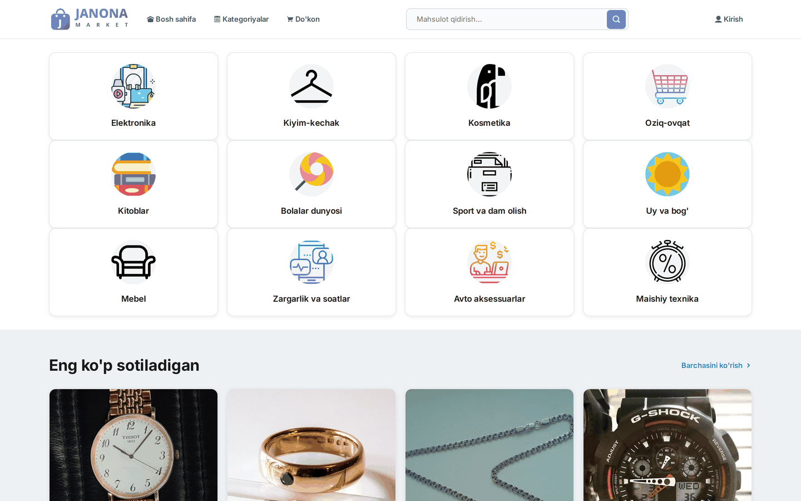
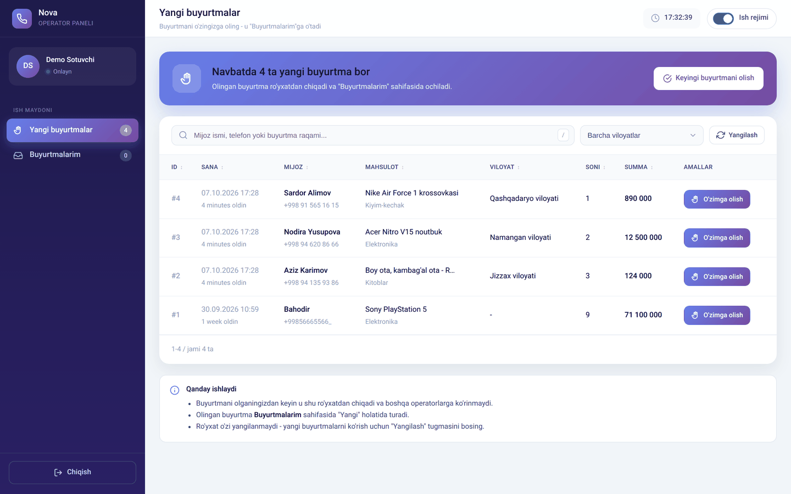
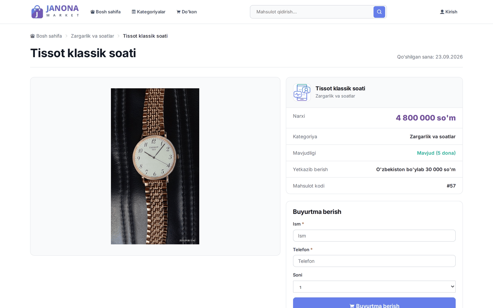
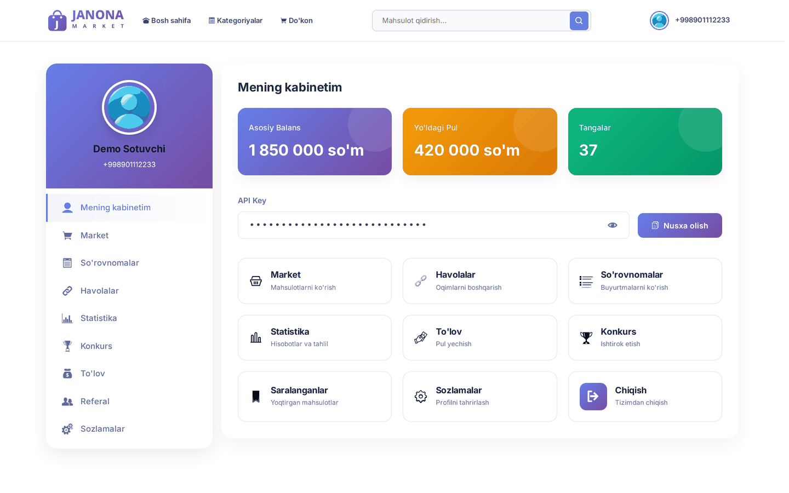
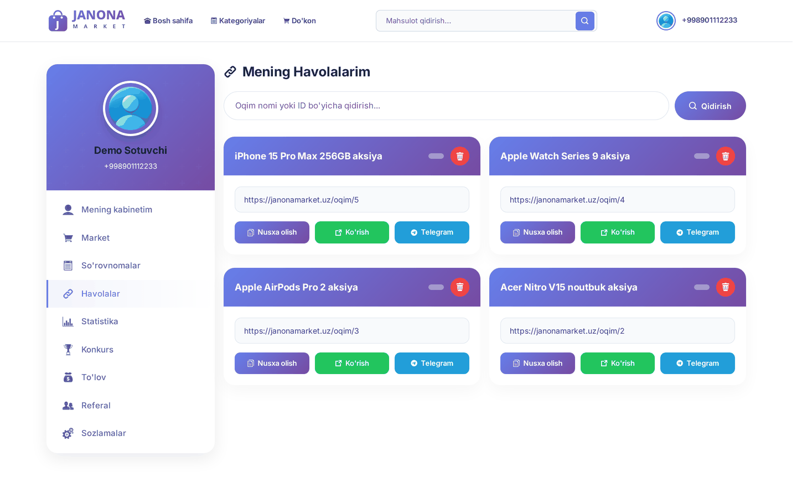
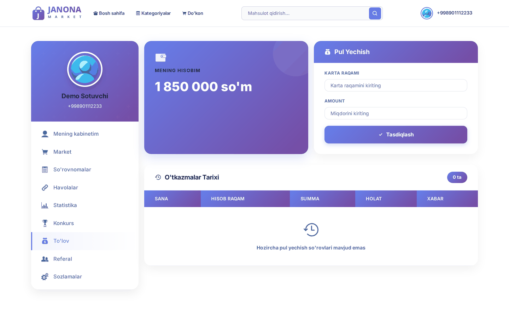
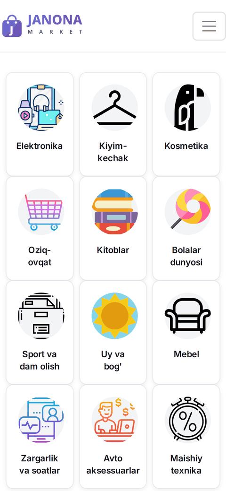

# Janona Market

O'zbekiston bo'ylab yetkazib berish xizmatiga ega, hamkorlik (affiliate) marketingiga
asoslangan onlayn-do'kon platformasi. Django ustida qurilgan to'liq stack ilova:
mijozlar uchun vitrina, sotuvchilar uchun shaxsiy kabinet, operatorlar uchun
buyurtmalarni qayta ishlash paneli va Django admin orqali boshqaruv.

## Ekranlar

Mijoz uchun vitrina — kategoriyalar, eng ko'p sotiladigan mahsulotlar, qidiruv.



Operator paneli — yangi buyurtmalar navbati, viloyat bo'yicha filtr, qidiruv,
buyurtmani o'ziga olish va status bo'yicha harakatlantirish.



<table>
  <tr>
    <td width="50%"><br>
      <sub>Mahsulot sahifasi — ro'yxatdan o'tmasdan ham buyurtma berish mumkin.</sub></td>
    <td width="50%"><br>
      <sub>Sotuvchi kabineti.</sub></td>
  </tr>
  <tr>
    <td><br>
      <sub>Hamkorlik tizimi: har bir mahsulot uchun shaxsiy sotuv havolasi (funnel).</sub></td>
    <td><br>
      <sub>Balans va pul yechish so'rovlari.</sub></td>
  </tr>
</table>

Telefonda:



## Imkoniyatlar

- **Mijozlar uchun** — kategoriyalar, mahsulot qidiruv/filtr, mahsulot sahifasi,
  ro'yxatdan o'tmasdan ham buyurtma berish imkoniyati.
- **Hamkorlik (referral) tizimi** — har bir sotuvchi mahsulotlar uchun o'z sotuv
  havolasini (funnel) yaratadi, chegirma belgilaydi va sotuvlardan komissiya oladi.
- **Sotuvchi kabineti** (`/admin_page/`) — statistikasi, havolalari, konkurslar,
  balans va pul yechish so'rovlari, referal tizimi, so'rovnomalar.
- **Operator paneli** (`/admin_page/orders/...`) — yangi buyurtmalarni navbatdan
  olish, statusini yangilash (qadoqlash → yetkazish → yetkazildi va h.k.),
  mijoz bilan bog'lanish tarixi.
- **Django admin** (`/admin/`) — foydalanuvchilar, mahsulotlar, kategoriyalar,
  buyurtmalar, viloyat/tuman, konkurslar va to'lovlarni to'liq boshqarish.
- Telefon raqami orqali autentifikatsiya (custom `User` modeli).

## Texnologiyalar

- **Backend:** Django 6, Python 3.14
- **Ma'lumotlar bazasi:** SQLite (dev)
- **Frontend:** Django shablonlari, Bootstrap, vanilla CSS/JS
- **Paket boshqaruvi:** [uv](https://github.com/astral-sh/uv)

## O'rnatish

```bash
git clone https://github.com/abuzafar-dev/Janona-Market.git
cd Janona-Market

# muhit va bog'liqliklarni o'rnatish
uv sync

# .env faylini yarating (namuna: .env.example)
cp .env.example .env
# .env ichidagi SECRET_KEY va TELEGRAM_BOT_TOKEN qiymatlarini o'zingiznikiga almashtiring

# migratsiyalar
uv run python manage.py migrate

# (ixtiyoriy) boshlang'ich ma'lumotlar
uv run python manage.py loaddata apps/fixtures/regions.json apps/fixtures/districts.json

# superuser yaratish
uv run python manage.py createsuperuser

# serverni ishga tushirish
uv run python manage.py runserver
```

Sayt manzili: `http://127.0.0.1:8000/`

## Loyiha tuzilishi

```
apps/            # asosiy Django ilovasi (models, views, forms, admin, urls)
apps/apps/       # statik fayllar manbasi (CSS/JS/rasmlar)
apps/fixtures/   # viloyat/tuman boshlang'ich ma'lumotlari
apps/migrations/ # DB migratsiyalari
root/            # loyiha sozlamalari (settings, urls, wsgi/asgi)
templates/       # HTML shablonlar (mijoz, sotuvchi kabineti, operator paneli)
media/           # foydalanuvchi yuklagan fayllar (mahsulot rasmlari va h.k.)
```

## Muhit o'zgaruvchilari

`.env.example` faylida kerakli o'zgaruvchilar ro'yxati keltirilgan:

| O'zgaruvchi | Tavsif |
|---|---|
| `SECRET_KEY` | Django maxfiy kaliti |
| `DEBUG` | Debug rejimi (`True`/`False`) |
| `ALLOWED_HOSTS` | Ruxsat etilgan hostlar, vergul bilan ajratilgan |
| `TELEGRAM_BOT_TOKEN` | Telegram bot tokeni |
| `TELEGRAM_CHANNEL_ID` | Telegram kanal ID/username |

## Litsenziya

Xususiy loyiha.
